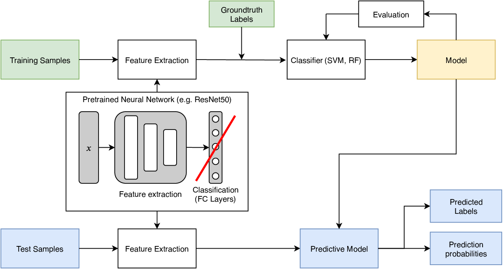

# Open AI Carribean Challenge

This repository documents my attempt to solve the *Open AI Caribbean Challenge: Mapping Disaster Risk from Aerial Imagery*, which was conducted between October and December 2019 on drivendata.org. A full description of the challenge and the datasets can be found [here](https://www.drivendata.org/competitions/58/disaster-response-roof-type/page/201/).

The proposed approach uses a ResNet50 pretrained on ImageNet as a feature extractor and a SVM as a classfier. The achieved log-loss of 0.5554 on the test corresponded to rank 51 in a field of 1425 competitors (top 4%).

I participated in this challenge as the final project of the "Image Processing for Earth Observation" course at EPFL. A full report can be found under `documentation`.

## 1 Introduction

Regions like the Carribean are regularly hit by rainstorms, floods or earthquakes. Despite being so prone to natural hazards, many houses in those areas are unable to withstand them due to poor construction quality.
International programs such as the World Bank's Global Program for Resilient Housing are making attempts to retrofit houses to the natural forces they are exposed to. 
The material that their roof is made up of is a central indicator for how well a house is prepared against natural disasters. 
Exploring these areas on the ground is time-consuming and costly. This is why the possibilities of image processing for automatic recognition of vulnerable houses on the basis of drone imagery are explored. Such a technology could assist building inspectors and narrow down large areas to those that are worth a closer inspection on the ground. 

## 2 Data Description

### 2.1 Images

The data provided for the challenge consists of high resolution (∼4 cm) drone imagery of five patches of land: two from Soacha, Colombia, two from Mixco, Guatemala and one from Dennery, St. Lucia. For every region, there is one stitched cloud-optimized GeoTIFF file, ranging from 500 to 1800 Megapixels in size. See a thumbnail of Dennery below:

### 2.2 Labels

Roofs are labeled as one of five material classes. The footprints of roofs are provided for both training and test set, i.e. roof segmentations are always given. There is a total of ~15000 training examples with highly unbalanced classes. The log-loss as score for the Open AI Challenge was computed on ~7320 test images, for which class membership probabilities needed to be calculated.
1. Concrete and Cement (1385 training samples): Roofs made out of concrete or cement.
2. Healthy Metal (7370): Roofs of metal that are intact but may be corrugated or galvanized.
3. Incomplete (668): Roofs that are severely damaged or under construction.
4. Irregular Metal (5236): Roofs that are slightly damaged, rusted or patched.
5. Other (193): Roofs that do not fit into other categories (include tiles, red painted, other materials).

| Concrete                                                     | Healthy Metal                                              | Incomplete                                                  | Irregular Metal                                             | Other                                                        |
| ------------------------------------------------------------ | ---------------------------------------------------------- | ----------------------------------------------------------- | ----------------------------------------------------------- | ------------------------------------------------------------ |
|  |  |  |  |  |
|  |  |  |  |  |

## 3 Classification Approach

The proposed processing routine uses a pretrained neural network as feature extractor. Different publicly available pretrained architectures, such as ResNet50, InceptionV3, DenseNet201 and VGG16 were tested.
The employed architectures had each been trained on more than a million images of 1000 categories from the ImageNet database. The features which are relevant to distinguish classes in ImageNet are very likely to be also relevant to discriminate other types of natural images, such as roofs. In order to obtain features, the classification layers were removed and replaced by an average or maximum pooling layer to reduce the number of features.

In the next step, a a SVM or RF was trained to classify roof materials based on the extracted features. The calculated classification could then be used to predict class membership based on features of test samples. The scikit-learn implementation of both SVM and RF provide pseudo-probabilities for class membership that take a samples' distance to the decision boundary into account. 

### 4 Results

The predictions to be submitted for the challenge were class membership probabilities and not hard labels. The best-performing setup consisted of a ResNet50 as feature extractor with average pooling at the end and classification using a SVM with a high regularization parameter C = 100.

The best result on the test in terms of log-loss 0.5554 corresponded to rank 51 in a field of 1425 competitors (top 4%).

Taking the maximum class membership probability results in the below confusion matrix using a random split. When visually assessing the result, the class imbalances should be kept in mind: only 4.5% of the roofs carry the ground truth label incomplete", 1.3% other". As expected the classifier struggles to identify the least represented classes correctly.

### 5 Discussion

At first glance the confusion matrix from above might not seem very impressive. Let's therefore look at the fails, why they might happen and what the implications for the real-life problem are.
1. Incomplete roofs: The recall on incomplete roofs is very low at only 30%. Looking at sample images above, the boundary between irregular and incomplete roofs is hard to define anyways. Both types of roofs carry a higher than normal risk to be destroyed during natural hazards. Therefore the misclassification of incomplete as irregular might be excusable. The truly problematic cases when considering risk assessment are those 21% that are labeled as concrete or healthy metal when they are actually heavily damaged.
2. Irregular metal roofs: These roofs are classified as healthy metal with 21% probability, which is bad for risk assessment. One cause for these errors could be the inconsistent labeling of rusty, but intact looking roofs. Interestingly, roofs of irregular metal are very unlikely to be labeled as incomplete as opposed to vice versa. One explanation for this might be that there are eight times more training examples for irregular than for incomplete, allowing for a better recall.
3. Other roofs: It is unsurprising that this class has a low recall, since it is the most diverse class and has very few training examples. It is reassuring that "other" roofs, which are intact, are almost never labeled as incomplete.

When taking these aspects into account, many misclassifications actually seem excusable or at least not so harmful to the actual goal of the project. It should also be considered that the proposed method tried to minimize the log-loss metric. A real-life classification system should have a high recall of high-risk roofs, which might require changes to the pipeline.

## Required packages

* rasterio: `pip install rasterio`

* scikit-learn: `pip install scikit-learn`

* keras: `conda install -c anaconda keras`

* Pyproj: `pip install pyproj`

* tqdm: `pip install tqdm`

* pandas `conda install pandas`

* seaborn `conda install seaborn`

* scikit-image `conda install scikit-image`

  
